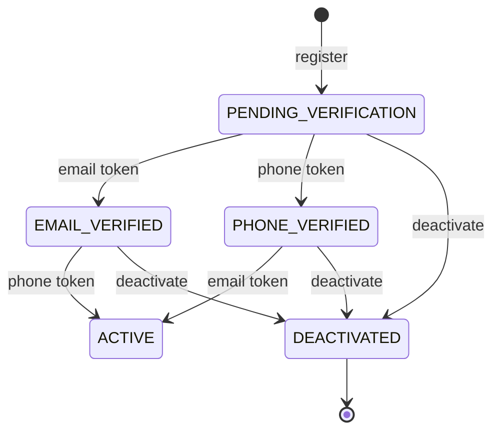

# Asynchronous Processing and Streaming System for Formula 1 Historical Telemetry

## Tech Stack
- Backend: Java, Spring Boot 
- Data Streaming: Spring WebSocket 
- DB: PostgreSQL 
- Caching: In-Memory (Spring ConcurrentMapCache)
- Async processing: Spring @Async, ExecutorService
- Notification: SMTP 
- Migrations: Liquibase 
- Infrastructure: Docker 
- Frontend: TypeScript, React

## Business Rules
### User Management

#### Registration
- Email (case-insensitive), phone number, and ID must be unique (`DuplicateUserException`). If `id` is omitted, a UUID is generated.
- The password is stored hashed and never returned in responses.
- Every new user starts as `PENDING_VERIFICATION` and gets two verification tokens (email and phone).
- After commit, the verification email and WhatsApp message are sent asynchronously. Each channel is independent: a send failure is logged and does not fail the registration.

#### Verification by token
- The token must exist and not be expired (`InvalidTokenException`).
- The token type selects the `VerificationStrategy`, which picks the next status. The transition must be allowed by the [transition matrix](####transition matrix), otherwise `InvalidUserStateException`.
- Tokens are single-use and deleted once applied.

#### Status management
- Every status change, manual or via token, is validated by the transition matrix.
- A user cannot change their own status.
- `DEACTIVATED` is final.
- A status change updates only the status; other fields stay untouched.

| Status | Meaning |
|---|---|
| `PENDING_VERIFICATION` | Initial status after registration. Neither email nor phone number has been confirmed yet. |
| `EMAIL_VERIFIED` | The user has confirmed their email address via the verification token. |
| `PHONE_VERIFIED` | The user has confirmed their phone number via the verification token (sent through WhatsApp). |
| `ACTIVE` | The account is fully usable. |
| `DEACTIVATED` | The account has been disabled. This is a terminal status: no further transitions are possible. |

#### Transition matrix
```agsl
    public boolean canTransitionTo(UserStatus next) {
        return switch (this) {
            case PENDING_VERIFICATION -> next == EMAIL_VERIFIED || next == PHONE_VERIFIED || next == DEACTIVATED;

            case EMAIL_VERIFIED, PHONE_VERIFIED -> next == ACTIVE || next == DEACTIVATED;

            case ACTIVE -> next == DEACTIVATED;

            case DEACTIVATED -> false;
        };
    }
```

#### State diagram

## User State Machine



- **Registration** always creates the user as `PENDING_VERIFICATION` and sends verification tokens by email and WhatsApp.
- **Token confirmation** moves the user forward. The next status is determined by the corresponding `VerificationStrategy`, and the transition is validated against the matrix above.
- **Manual status update** (`updateStatus`) is subject to the same matrix. Users cannot change their own status.
- **Deactivation** is possible from any non-terminal status, but is irreversible.

#### Errors

| Exception | Raised when |
|---|---|
| `DuplicateUserException` | Email, phone, or ID already exists |
| `InvalidTokenException` | Token is missing or expired |
| `InvalidUserStateException` | Illegal transition, self status change, or missing verification strategies |
| `EntityNotFoundException` | User (or token owner) not found |

## Commands
- Compile the whole project: `mvn clean install`
- Run backend modules: `mvn spring-boot:run` (inside some module)
- Check test coverage: `mvn clean verify`

## Swagger
### Core module
http://localhost:8080/api/v1/swagger-ui/index.html

### Processing module
http://localhost:8082/api/v1/swagger-ui/index.html

### Streaming Gateway module
http://localhost:8081/api/v1/swagger-ui/index.html
