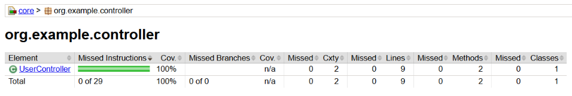
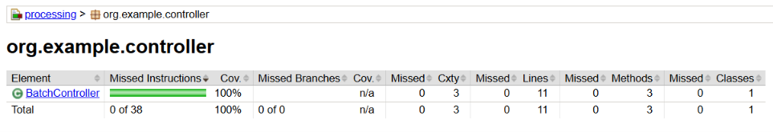
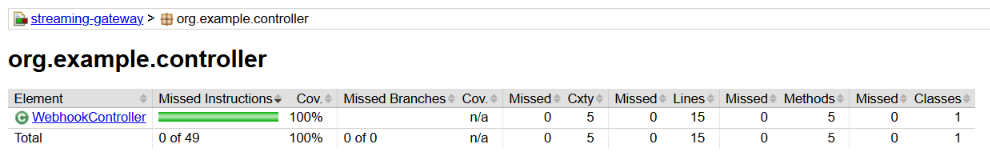

# Asynchronous Processing and Streaming System for Formula 1 Historical Telemetry

## Tech Stack
- Backend: Java, Spring Boot 
- Data Streaming: Spring WebSocket 
- DB: PostgreSQL 
- Caching: In-Memory (Spring ConcurrentMapCache)
- Async processing: Spring @Async, ExecutorService
- Notification: SMTP 
- Migrations: Liquibase 
- Infrastructure: Docker 
- Frontend: TypeScript, React

## Commands
- Compile the whole project: `mvn clean install`
- Run backend modules: `mvn spring-boot:run` (inside some module)
- Check test coverage: `mvn clean verify`

## Swagger
### Core module
http://localhost:8080/api/v1/swagger-ui/index.html

## Processing module
http://localhost:8082/api/v1/swagger-ui/index.html

## Streaming Gateway module
http://localhost:8081/api/v1/swagger-ui/index.html

## Current Test Coverage (REST API interation tests)
### Core module

### Processing module

### Streaming Gateway module

