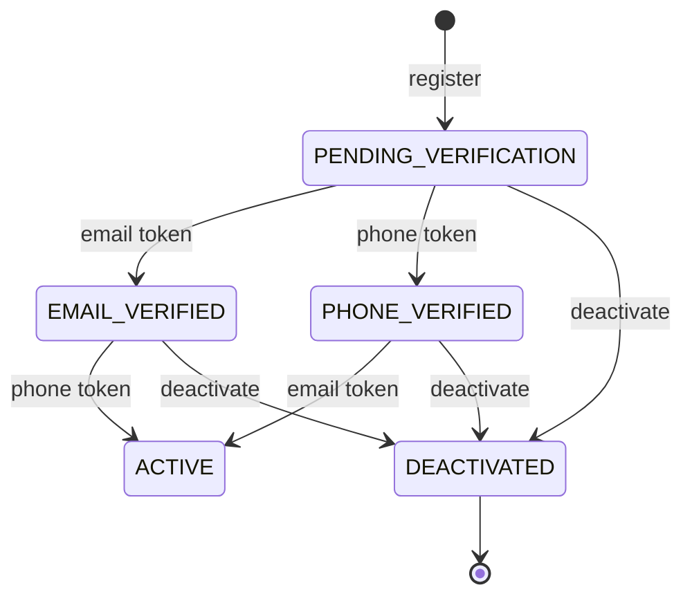

# Asynchronous Processing and Streaming System for Formula 1 Historical Telemetry

## Tech Stack
- Backend: Java, Spring Boot 
- Data Streaming: Spring WebSocket 
- DB: PostgreSQL 
- Caching: In-Memory (Spring ConcurrentMapCache)
- Async processing: Spring @Async, ExecutorService
- Notification: SMTP 
- Migrations: Liquibase 
- Infrastructure: Docker 
- Frontend: TypeScript, React

## Business Rules
### User Management

#### Registration
- Email (case-insensitive), phone number, and ID must be unique (`DuplicateUserException`). If `id` is omitted, a UUID is generated.
- The password is stored hashed and never returned in responses.
- Every new user starts as `PENDING_VERIFICATION` and gets two verification tokens (email and phone).
- After commit, the verification email and WhatsApp message are sent asynchronously. Each channel is independent: a send failure is logged and does not fail the registration.

#### Verification by token
- The token must exist and not be expired (`InvalidTokenException`).
- The token type selects the `VerificationStrategy`, which picks the next status. The transition must be allowed by the [transition matrix](####transition matrix), otherwise `InvalidUserStateException`.
- Tokens are single-use and deleted once applied.

#### Status management
- Every status change, manual or via token, is validated by the transition matrix.
- A user cannot change their own status.
- `DEACTIVATED` is final.
- A status change updates only the status; other fields stay untouched.

| Status | Meaning |
|---|---|
| `PENDING_VERIFICATION` | Initial status after registration. Neither email nor phone number has been confirmed yet. |
| `EMAIL_VERIFIED` | The user has confirmed their email address via the verification token. |
| `PHONE_VERIFIED` | The user has confirmed their phone number via the verification token (sent through WhatsApp). |
| `ACTIVE` | The account is fully usable. |
| `DEACTIVATED` | The account has been disabled. This is a terminal status: no further transitions are possible. |

#### Transition matrix
```agsl
    public boolean canTransitionTo(UserStatus next) {
        return switch (this) {
            case PENDING_VERIFICATION -> next == EMAIL_VERIFIED || next == PHONE_VERIFIED || next == DEACTIVATED;

            case EMAIL_VERIFIED, PHONE_VERIFIED -> next == ACTIVE || next == DEACTIVATED;

            case ACTIVE -> next == DEACTIVATED;

            case DEACTIVATED -> false;
        };
    }
```

#### User State Machine



- **Registration** always creates the user as `PENDING_VERIFICATION` and sends verification tokens by email and WhatsApp.
- **Token confirmation** moves the user forward. The next status is determined by the corresponding `VerificationStrategy`, and the transition is validated against the matrix above.
- **Manual status update** (`updateStatus`) is subject to the same matrix. Users cannot change their own status.
- **Deactivation** is possible from any non-terminal status, but is irreversible.

#### Errors

| Exception | Raised when |
|---|---|
| `DuplicateUserException` | Email, phone, or ID already exists |
| `InvalidTokenException` | Token is missing or expired |
| `InvalidUserStateException` | Illegal transition, self status change, or missing verification strategies |
| `EntityNotFoundException` | User (or token owner) not found |

### Webhook Management

#### Registration
- Webhook `id` is generated server-side (random `Long`, not client-provided).
- `webhookURL`, `userID`, and `webhookType` are required and validated at the controller level (valid URL, non-zero user id, known webhook type).
- No uniqueness constraint is currently enforced — a user can register multiple webhooks with the same URL/type.
- Storage is currently in-memory (`ConcurrentHashMap`), not yet persisted to the DB.

#### Lifecycle
- `get` / `update` / `delete` by id throw `EntityNotFoundException` if the webhook does not exist.
- `update` replaces `webhookURL`, `userID`, and `webhookType`; `createdAt` is preserved from the original entity, `updatedAt` is refreshed to the current time.

#### Errors

| Exception | Raised when |
|---|---|
| `EntityNotFoundException` | Webhook not found by id (get/update/delete) |

---

### Batch Management

#### Upload
- Batch `id` is a generated `UUID`.
- On successful save, a `BatchCreatedEvent` (batchId, raceName, year, createdAt, deletedAt) is published for downstream/async processing (e.g. triggering telemetry ingestion from the 3rd-party API).
- `deletedAt` is `null` on creation — reserved for a future soft-delete flow.

#### Listing
- `getBatches()` returns all batches.

#### Errors

| Exception | Raised when |
|---|---|
| `DuplicateBatchException` | Batch with the generated id already exists (not currently reachable) |

### 3-Party APIs

**1. Fetch info about race by name and year:**

```GET https://api.openf1.org/v1/sessions?year={year}&country_name={raceName}&session_name=Race```

Race name == country name
Response example:
```json
[
  {
    "session_key": 9523,
    "session_type": "Race",
    "session_name": "Race",
    "date_start": "2024-05-26T13:00:00+00:00",
    "date_end": "2024-05-26T15:00:00+00:00",
    "meeting_key": 1236,
    "circuit_key": 22,
    "circuit_short_name": "Monte Carlo",
    "country_key": 114,
    "country_code": "MON",
    "country_name": "Monaco",
    "location": "Monaco",
    "gmt_offset": "02:00:00",
    "year": 2024,
    "is_cancelled": false
  }
]
```

**2.Get drivers info:**
```GET https://api.openf1.org/v1/drivers?session_key={session_key}```

Response example:
```json
[
    {
        "meeting_key": 1236,
        "session_key": 9523,
        "driver_number": 1,
        "broadcast_name": "M VERSTAPPEN",
        "full_name": "Max VERSTAPPEN",
        "name_acronym": "VER",
        "team_name": "Red Bull Racing",
        "team_colour": "3671C6",
        "first_name": "Max",
        "last_name": "Verstappen",
        "headshot_url": "https://media.formula1.com/d_driver_fallback_image.png/content/dam/fom-website/drivers/M/MAXVER01_Max_Verstappen/maxver01.png.transform/1col/image.png",
        "country_code": "NED"
    },
    ...
]
```

**3. Get telemetry info by each driver**
```GET https://api.openf1.org/v1/location?session_key={session_key}&driver_number={driver_number}```

Response example
```json
[
    {
        "date": "2024-05-26T12:08:08.143000+00:00",
        "session_key": 9523,
        "y": 0,
        "x": 0,
        "z": 0,
        "meeting_key": 1236,
        "driver_number": 1
    },
    ...
]
```

## Commands
- Compile the whole project: `mvn clean install`
- Run backend modules: `mvn spring-boot:run` (inside some module)
- Check test coverage: `mvn clean verify`

## Swagger
### Core module
http://localhost:8080/api/v1/swagger-ui/index.html

### Processing module
http://localhost:8082/api/v1/swagger-ui/index.html

### Streaming Gateway module
http://localhost:8081/api/v1/swagger-ui/index.html
